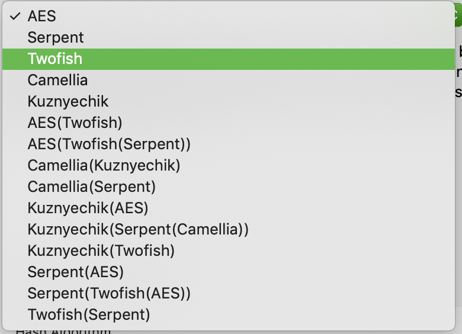
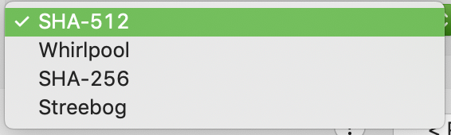

#Password probe for trueCrypt container

As basis serves TruePax(Copyright (C) 2015  CODERSLAGOON) code, which contains all functions for password list attack on container.

##TODO List

List with encryption algorithms.  

  

List with hash algorithms.  

